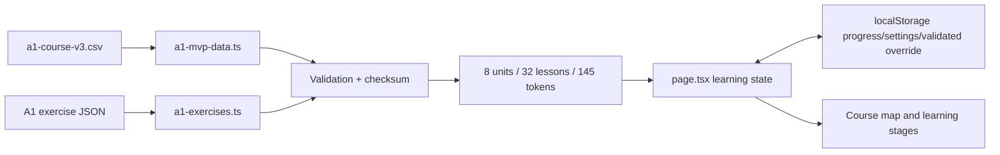

# System Architecture

## Overview

EnglishWeb is a Vinext/React client application deployed through a Cloudflare Worker-compatible build. It has no application backend or account system. Curriculum and exercise files are static assets; learner state is device-local.

## Runtime Flow

At startup, the app loads official curriculum and exercise data, validates both, computes the curriculum revision, and builds `CourseUnit[]`. A saved local curriculum is restored only when its version and revision match the official source. Progress and settings load independently and are normalized before use.

## Module Responsibilities

- `app/page.tsx`: screen navigation, learning-stage orchestration, speech fallback, content management, and persistence wiring.
- `app/a1-mvp-data.ts`: CSV parsing, normalization, validation, checksums, versioned storage, and course construction.
- `app/a1-exercises.ts`: pattern/reading schemas, prerequisite and slot validation, coverage reporting, and answer checks.
- `app/course-data.ts`: stable TypeScript course types plus A–Z static data; no lesson content.
- `app/learning-progress.ts`: token/entity history and review scheduling.
- `app/learning-adaptation.ts`: hint level and review-exercise selection.
- `app/rebuild-flow.ts`, `app/passage-flow.ts`, `app/assessment-scoring.ts`: pure evaluation rules.
- `app/kk-phonetics.ts`: separate KK symbol curriculum and audio metadata mapping.
- `worker/index.ts`: Vinext request and image handling for hosted deployment.

## Data Boundaries

The hierarchy is Level → Unit → Lesson → Stage → Exercise. Within a sentence:

- occurrence/token rows define one-word answers;
- `lexeme_id` joins the same word across case and occurrence;
- `sense_id` distinguishes contextual meaning;
- `chunk_*` joins several word rows for whole-phrase teaching;
- `sentence_pattern_id` joins grammatical structures;
- `passage_id` and `sentence_order` join ordered sentences.

These layers are additive and must not be collapsed into one input model.

## Persistence

Browser storage holds progress schema v3, settings, and validated course overrides. Official static files remain authoritative; a changed official checksum invalidates stale overrides. No personal data is sent to a project-owned server.

## Quality Gates

- Unit tests verify row counts, IDs, data round-trips, prerequisites, scoring, adaptation, and passage behavior.
- Render checks verify Traditional Chinese product output.
- Playwright runs real desktop (1440×900) and mobile (375×812) learning flows and persistence.
- CI requires build, unit tests, lint, TypeScript, then browser tests.
