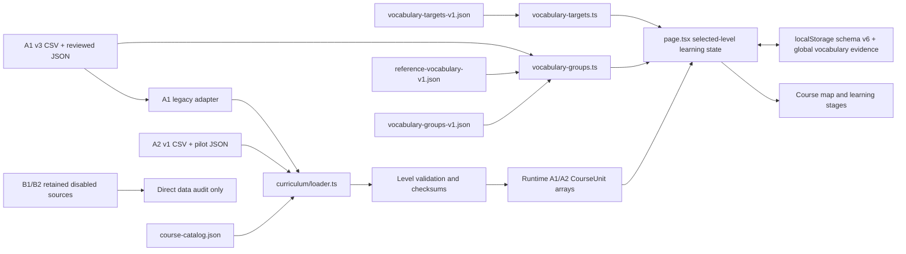
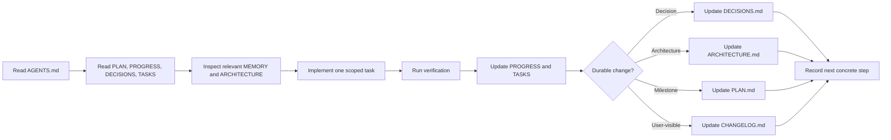

# System Architecture

## Overview

英句練習 is a Vinext/React client application deployed through a Cloudflare Worker-compatible build. It has no application backend or account system. Curriculum and exercise files are static assets; learner state is stored on the device.

## Runtime Flow

At startup, the app loads the catalog, then loads only A1 and A2. Catalog entries marked `disabled` are filtered before fetch and rejected by direct runtime loader calls. B1/B2 CSV/JSON remains available to project audits, generators, and structural unit tests. The A1 legacy adapter preserves production v3 behavior. A saved local curriculum is restored only when its level version and revision match the official source.

## Module Responsibilities

- `app/page.tsx`: screen navigation, learning-stage orchestration, speech fallback, content management, and persistence wiring.
- `app/curriculum/catalog.ts`: catalog parsing, release state, formal unlock, and QA-preview access.
- `app/curriculum/loader.ts`: common level loading and source revision calculation.
- `app/curriculum/validation.ts`: generic one-word, identity, relation, chunk, pattern, passage, and audio-state checks.
- `app/curriculum/progress.ts`: schema v6 migration, isolated course progress, and top-level global vocabulary progress.
- `app/curriculum/storage.ts`: level-aware source version, revision, update time, and override storage.
- `app/curriculum/a1-legacy-adapter.ts`: A1 compatibility boundary around the established v3 builder.
- `app/a1-mvp-data.ts`: CSV parsing, normalization, validation, checksums, versioned storage, and course construction.
- `app/a1-exercises.ts`: pattern/reading schemas, prerequisite and slot validation, coverage reporting, and answer checks.
- `scripts/create-a2-pilot-data.mjs`: reproducibly builds the single A2 pilot CSV while preserving unit 1 definitions.
- `scripts/create-a2-pilot-exercises.mjs`: reproducibly appends units 2–4 exercises and passages to the existing unit 1 JSON.
- `scripts/create-b1-b2-curriculum.mjs`: reproducibly generates the B1/B2 pilot CSV and exercise JSON sources.
- `scripts/audit-project-data.mjs`: detects catalog-orphaned sources, duplicate files/IDs, unsafe repetitions, generator key collisions, and tracked build artifacts.
- `app/course-data.ts`: stable TypeScript course types plus A-Z static data; it is not a second A1 lesson source.
- `app/learning-progress.ts`: token/entity history and review scheduling.
- `app/learning-adaptation.ts`: hint level and review-exercise selection.
- `app/input-flow.ts`: pure third-attempt recall feedback and cross-input boundary-navigation rules shared by recall and rebuild UI.
- `app/rebuild-flow.ts`, `app/passage-flow.ts`, `app/assessment-scoring.ts`: pure evaluation rules.
- `app/kk-phonetics.ts`: separate KK symbol curriculum and audio metadata mapping.
- `app/vocabulary-groups.ts`: related-topic schemas, validation, formal/reference resolution, search normalization, learning-state display, and isolated loading.
- `app/vocabulary-targets.ts`: canonical A1/A2 target validation, indexes, and coverage summaries.
- `app/vocabulary-progress.ts`: stable evidence recording, deduplication, and exposed/receptive/active derivation.
- `app/daily-session.ts`: pure daily-session sequencing and evidence-delta summary rules; the active session itself remains transient UI state.
- `scripts/create-vocabulary-target-baseline.mjs`: reproducibly projects current A1/A2/reference sources into the partial target contract.
- `scripts/audit-vocabulary-targets.mjs` and `scripts/report-vocabulary-coverage.mjs`: target integrity and occurrence/form/sense/chunk/lexeme reporting.
- `worker/index.ts`: Vinext request and image handling for hosted deployment.

## Data Boundaries

The hierarchy is Level -> Unit -> Lesson -> Stage -> Exercise. Within a sentence:

- occurrence/token rows define one-word answers;
- `lexeme_id` joins the same word across case and occurrence;
- `sense_id` distinguishes contextual meaning;
- `chunk_*` joins several word rows for whole-phrase teaching;
- `sentence_pattern_id` joins grammatical structures;
- `passage_id` and `sentence_order` join ordered sentences.

These layers are additive and must not be collapsed into one input model.

Related vocabulary is a read-only projection over formal A1 lexemes plus explicitly reference-only gaps. Topic and chunk relationships use stable IDs. Cards display the canonical lemma and may apply a validated group-level Traditional Chinese override, while progress, occurrences, audio, and source identity stay formal. Search resolution keeps the active topic when it matches, otherwise selects the first matching topic, and returns no active detail when no group matches.

A2 uses one CSV and two exercise JSON files for all four pilot units. B1 and B2 each retain one independent v1 CSV plus pattern and reading JSON, but their catalog status is `disabled` and they are not runtime sources. All advanced rows stay `pilot_review_required`.

The 3000 goal counts canonical single-word lexemes only. The current partial baseline contains every A1/A2 curriculum lexeme plus unique reference-only lexemes. Word forms, occurrences, senses, and chunks are reported separately. The baseline does not imply that the full 3000 list exists.

Passage comprehension keeps `options` as strings for UI and A1 compatibility. New A2 passage questions also declare `optionMetadata` with the lexeme and chunk prerequisites for each option. Validation uses the latest lesson attached to the passage as the prerequisite boundary, so a distractor cannot introduce vocabulary or chunks from a later unit.

## Persistence

Browser storage holds progress schema v6, settings, and validated per-level course overrides. A v3 record preserves A1, v4 preserves A1/A2, and v5 preserves all course levels; all old records initialize empty global vocabulary evidence rather than inferring mastery. `vocabularyProgress` is keyed by canonical lexeme and is shared across A1/A2. Official static files remain authoritative, and a changed level checksum invalidates only that level's stale override. No personal data is sent to a project-owned server.

## Context Documentation Flow

`PROGRESS.md` is the current verified state, not a diary. `MEMORY.md` stores long-lived facts, not today's tasks. `DECISIONS.md` records why durable choices exist.

## Quality Gates

- `npm run check:context` verifies the project-context files and encoding.
- `npm run audit:project` verifies catalog coverage, source uniqueness, intentional review repetitions, generator dictionaries, and ignored build outputs.
- Unit tests verify per-level row counts, cross-level ID isolation, migration fidelity, data round-trips, prerequisites, scoring, adaptation, and passage behavior.
- Render checks verify Traditional Chinese product output.
- Playwright runs real desktop (`1440x900`) and mobile (`375x812`) A1/A2 learning, passage, error-isolation, vocabulary-evidence, and persistence flows. B1/B2 remain in direct data tests only while disabled.
- Saved-state Playwright fixtures are installed with `page.addInitScript` before application hydration and never overwrite progress produced later in the same test.
- Browser interactions wait for observable level-home and course-map readiness rather than fixed sleeps.
- A2 browser coverage walks all 12 newly added lesson flows, all three new passages, formal sequential unlocking, QA inspection, reload persistence, and the no-full-level-pass boundary.
- Related-vocabulary checks cover source priority, topic ordering, search, status derivation, progress neutrality, course return, responsive layout, and data-failure isolation.
- CI requires context checks, build, unit tests, lint, TypeScript, and browser tests, then retains the Playwright HTML report, failure screenshots, error context, and traces for diagnosis.
