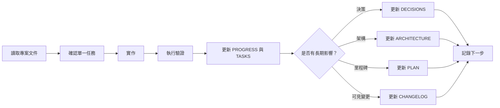

# Context Engineering 工作流程

## 核心原則

不要要求 AI 記住所有事情，而是讓 AI 知道可靠資訊放在哪裡。

專案狀態以版本控制中的文件為準。聊天內容可以協助討論，但不能取代已整理的規則、決策、進度與架構。

## 八份核心文件

| 文件 | 用途 | 何時更新 |
|---|---|---|
| `AGENTS.md` | AI 工作規則、資料規範與驗證要求 | 工作方式或全域規則改變時 |
| `PLAN.md` | 產品方向、里程碑與 Roadmap | 里程碑開始、完成或範圍改變時 |
| `PROGRESS.md` | 已驗證的目前狀態與下一步 | 每次完成可驗證工作後 |
| `DECISIONS.md` | 長期產品與技術決策及原因 | 做出會影響未來工作的選擇時 |
| `TASKS.md` | 目前優先順序與驗收條件 | 任務開始、完成、取消或改變優先度時 |
| `MEMORY.md` | 長期產品事實、限制與使用者偏好 | 長期有效的事實改變時 |
| `CHANGELOG.md` | 使用者或貢獻者看得到的版本變更 | 有可見變更時 |
| `ARCHITECTURE.md` | 系統模組、資料邊界與執行流程 | 架構或責任邊界改變時 |

## 開始工作

1. 讀取 `AGENTS.md`。
2. 讀取 `PLAN.md`、`PROGRESS.md`、`DECISIONS.md`、`TASKS.md`。
3. 依工作範圍閱讀 `MEMORY.md` 與 `ARCHITECTURE.md`。
4. 檢查 `CHANGELOG.md`，避免重複或撤銷近期修改。
5. 查看程式碼、測試與 Git 狀態，確認文件仍符合實際狀況。
6. 從 `TASKS.md` 選擇一個具體任務或緊密相關的小批次。

## 建議工作循環



## 文件責任邊界

- `PROGRESS.md` 只寫已驗證狀態，不寫未完成的期待。
- `TASKS.md` 只保留目前優先工作，不累積歷史日誌。
- `DECISIONS.md` 記錄「為什麼」，不能只寫結果。
- `MEMORY.md` 保存長期有效事實，不保存本次操作細節。
- `CHANGELOG.md` 面向使用者與貢獻者，不複製 Git diff。
- `ARCHITECTURE.md` 描述責任與資料流，不逐行解釋程式碼。

## Milestone 與新對話

下列情況應開啟新對話：

- 一個 Milestone 已完成。
- 工作從課程內容切換到完全不同的領域，例如部署或音訊授權。
- 對話已累積大量已完成工作，開始重複說明或遺漏先前決策。

開新對話前：

1. 更新 `PROGRESS.md`。
2. 完成或重新排序 `TASKS.md`。
3. 若有長期決策，更新 `DECISIONS.md`。
4. 若完成 Milestone，更新 `PLAN.md`。
5. 若有可見變更，更新 `CHANGELOG.md`。

## 新對話啟動 Prompt

```text
請先閱讀 AGENTS.md、PLAN.md、PROGRESS.md、DECISIONS.md、
TASKS.md、MEMORY.md 與 ARCHITECTURE.md。

先確認目前已完成內容、現行限制、已接受決策與下一個具體任務。
不要重新設計已完成並通過驗證的部分，也不要只依賴舊聊天紀錄。

本次請處理 TASKS.md 中的：
<填入任務 ID 與名稱>

完成後：
1. 執行該任務需要的測試。
2. 更新 PROGRESS.md 與 TASKS.md。
3. 有長期決策時更新 DECISIONS.md。
4. 影響 Milestone 時更新 PLAN.md。
5. 有可見變更時更新 CHANGELOG.md。
```

## 常見錯誤

- 在同一個長對話中無限延伸不同主題。
- 每次都重新討論已接受的架構或資料規則。
- 完成功能卻不更新 `PROGRESS.md`。
- 只寫「已完成」，沒有記錄實際驗證結果。
- 把暫時想法寫進 `MEMORY.md`。
- 同時建立第二份課程真實來源。
- 為了通過測試而降低驗收標準。

## 完成檢查

- [ ] 已讀取相關專案文件。
- [ ] 變更範圍對應一個明確任務。
- [ ] 已執行並記錄實際測試。
- [ ] `PROGRESS.md` 只包含已驗證事實。
- [ ] `TASKS.md` 的優先順序仍正確。
- [ ] 長期決策與架構變更已寫入對應文件。
- [ ] 已留下下一個具體步驟。
- [ ] Milestone 完成時已準備新對話交接。
